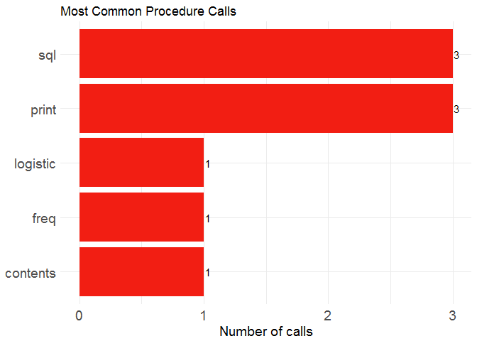
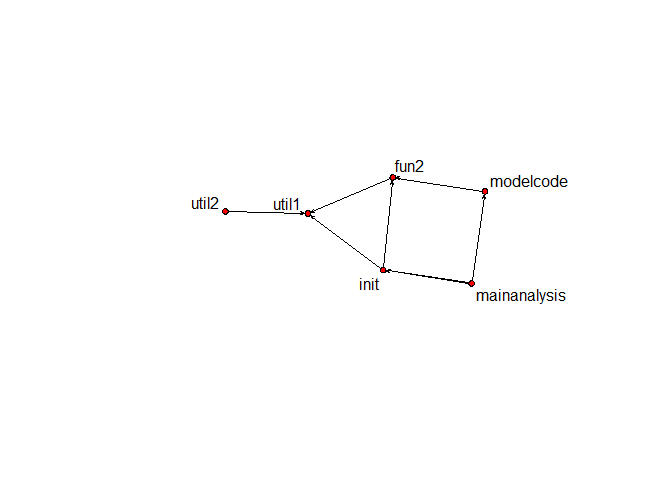

# sasMap: static code analysis for SAS
Ava Yang  


You may drop your weapons, this is not going to be about SAS vs R. If you work with a large amount of SAS legacy code, **sasMap**, an R package with a **Shiny** app, is for you. It evolved from our experience in migrating SAS to R, see Mark Sellor's [post](http://www.mango-solutions.com/wp/2017/02/production-r-at-ons/) about production R at ONS for an example.

_Disclaimer_: there's no such thing as SAS-to-R auto translator, yet. sasMap is a map that can keep you on track by making it easy to look for a path through a wild land.

## Overview
Often multiple macros are nested to construct main SAS analyses. User macros are held in sub-folders and are called in top level scripts. **sasMap** calculates summary statistics of SAS scripts and helps to understand macro and script dependency. The key functionalities of the package are:

*	Extract summary statistics such as procs and data steps
*	Draw a barplot of proc calls
*	Visualize static and interactive network of script dependency

And to accomplish this the package provides the following functions:

*	**parseSASscript** Parse a SAS script
*	**parseSASfolder** Parse a SAS folder
*	**listProcs** List frequency of various proc calls
*	**drawProcs** Draw frequency of various proc calls in a bar plot
*	**plotSASmap** Draw script dependency in static plot
*	**plotSASmapJS** Draw script dependency in interactive way

## Demo

The package includes some dummy SAS code in the \examples\SAScode\Macros folder. The folder contains one high level script _MainAnalysis.SAS_ and a subfolder called _Macros_ where the user's macros live. The main assumption is that each macro corresponds to a script of the same name. Some macros are called but don't have a named script. For example, %summary in _Util2.SAS_, is not displayed in the static network representation, whereas it belongs to internal macros group in the interactive network graph.

The summary statistics include measures such as number of lines (nLines), Procs, number of data step (Data_step), macro calls (Macro_call) and macro defined (Macro_define).


```r
# Install sasMap from github
devtools::install_github("MangoTheCat/sasMap")

# Load library
library(sasMap)

# Navigate to target directory
sasDir <- system.file('examples/SAScode', package='sasMap')

# Parse SAS folder
kable(parseSASfolder(sasDir))
```

               Script          nLines  Procs                    Data_step  Macro_call        Macro_define 
-------------  -------------  -------  ----------------------  ----------  ----------------  -------------
fun2           fun2                 8  sql(1)                           0  util1             fun2         
init           Init                 9  sql(1)                           0  fun2, util1       init         
modelcode      ModelCode           18  logistic(1), print(2)            0  fun2              modelcode    
util1          Util1               13  freq(1), print(1)                0  fun1              util1        
util2          Util2                9  contents(1), sql(1)              0  util1, summary    util2        
mainanalysis   MainAnalysis         9                                   2  init, modelcode                


```r
# Draw frequency of proc calls
drawProcs(sasDir)
```

<!-- -->


```r
# Draw network of SAS scripts. A pdf file can be created by specifying the file name.
net <- renderNetwork(sasDir)
# plotSASmap(net, width=10, height=10, pdffile='sasMap.pdf') 
plotSASmap(net, width=10, height=10)
```

<!-- -->

```r
## Alternatively, draw it interactively (not run here)
plotSASmapJS(sasDir)
```

## Put them together
The **sasMap** package is accompanied by a shiny app which you can run by executing the following line of code:

```r
library(shiny)
runApp(system.file('shiny', package='sasMap'))
```

Once the "I want to specify a local directory (Warning: It only works when running the shiny app from a local machine)." box is ticked, exposed is a "Choose directory" button which makes it straightforward to direct to your SAS folder (thanks to the **shinyFiles** package). You can also view a demo version of the app [here](https://mangothecat.shinyapps.io/sasmap/). For demo's purpose, the deployed version has the dummy SAS code hard-coded.

## Conclusion
At Mango we have benefited greatly from this way of working with SAS code (see this [blogpost](http://www.mango-solutions.com/wp/2017/03/goodbye-sas-hello-r-why-you-need-to-make-the-switch-and-how-mango-can-help/) for more information). If you want to know more about the **sasMap** package or about SAS to R migration feel free to contact us by phone (+44 (0)1249 705 450) or mail (sales@mango-solutions.com). The code for this post is available on [github](https://github.com/MangoTheCat/blog_sasmap) as is the code for the [package](https://github.com/MangoTheCat/sasMap).


